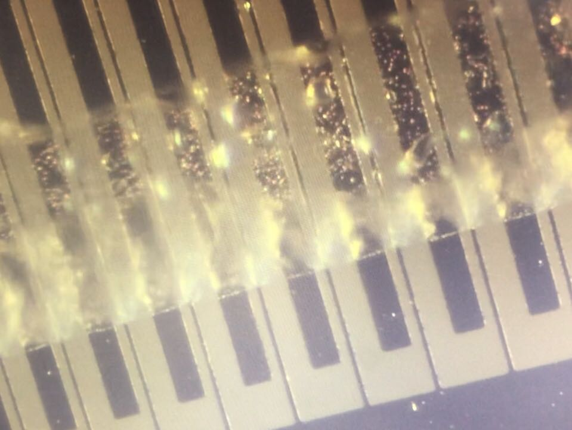

# Design of Integrated Microrobotic Fish

Field: Design, simulation, and fabrication of microfludic chip and channel

Course: VE490

Term: Spring 2021

Instructor: Prof. Xuyang Lu

Students: [Kexin Li](https://github.com/Salt-ops), [Yihua Liu](https://github.com/yihuajack)

Techniques:

- Physics: electromagnetics and fluid mechanics (coupling)
- Numerical analysis: MATLAB and Mathematica
- Layout design: KLayout
- Simulation: COMSOL Multiphysics (*spf+ec+tds* and FSI)
- Experiment: photolithography, deposition, PDMS bonding, and wire bond

Result:

See the final report for details.
